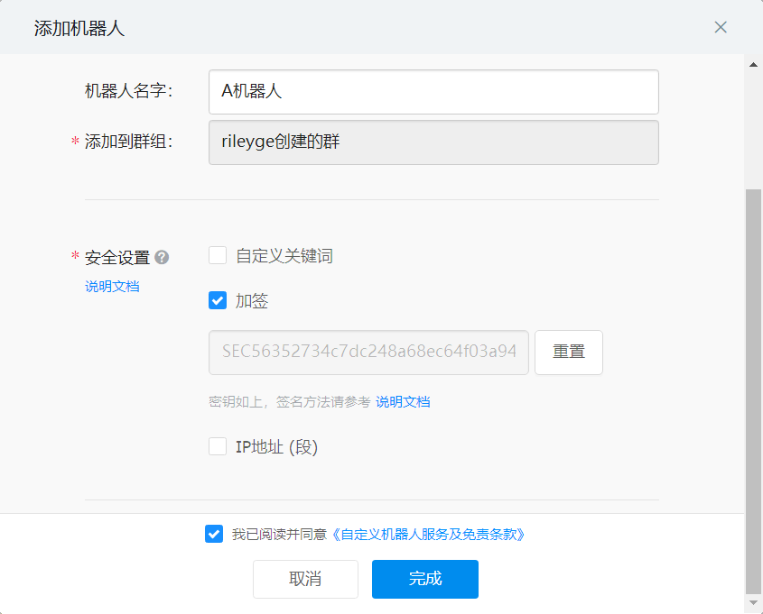
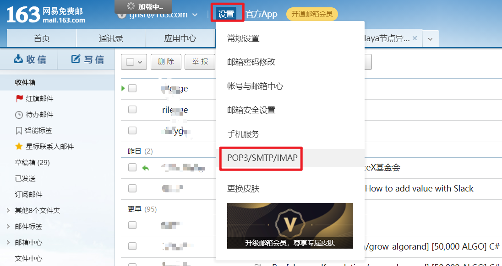

# Alaya网络节点监控机器人

节点状态改变提醒软件。当节点状态发生以下改变时，会发出提醒（提醒最短间隔可以设定）：

 - 委托量改变量大于阈值（可以自己设定）时发出提醒。

 - 节点排名改变量大于阈值（可以自己设定）时发出提醒。
   
 - 节点排名到达XXX名之后（可以自己设定）发出提醒。
   
 - 节点状态出现异常，如节点不可用，节点出块率低但没有达到移除条件的，节点的von不足最低质押门槛，节点被举报双签，节点出块率低且达到移除条件，节点主动发起撤销等。

提醒方式可选用以下两种：

 - 邮件提醒。需要邮件支持SMTP发信。注意：不同的邮件服务商业对邮件发出的频率可能会有限制，使用时请注意此问题。
   
 - 钉钉提醒。（群内机器人提醒，可以@）

该程序需要持续运行才能提醒。可以在Windows、Mac或Linux系统中运行。本程序可以同时进行多个节点的提醒工作，不需要每个节点都运行一份程序。

## 0、快速安装运行

```shell
pip install -r requriements.txt
python main.py
```

## 1、Python依赖环境安装

对于python环境的安装，这里不再多叙述，请大家自行搜索，无论在Windows还是Mac，Linux上安装的教程都相当多。而且python版本支持也相当广泛。当然，笔者的开发环境是Python 3.7，也推荐大家使用。

安装依赖库：

`pip install -r requriements.txt `

## 2、配置文件

项目中有一个示例的配置文件，需要更改后使用。配置文件中的注释信息已经详细说明了如何使用配置文件，这里就不再赘述。只针对使用钉钉和邮件进行提醒的内容作进一步说明。

### 2.1、钉钉

可能部分朋友们已经被钉钉毒打了多年，对于如何建群，如果添加自定义机器人已经非常熟悉，这样的同学请自觉跳过此章节。对于小白同学们我这里作一个简单的说明。

 - 建群：例如使用面对面建群，随意输入4位数字。后期也可以通过输入相同数字或者邀请入群。

 - 添加自定义机器人：建群后在**电脑端**（现阶段手机不支持此功能）打开群设置->智能群助手->添加机器人->自定义->添加。然后你就可以设置机器人的名字、图片、添加到哪个群等信息。设置完成后直接单击下一步。下一步中会要求进行安全设置，我们选择**加签**，然后将签名信息写入到`config.ini`的`[dingding]`类别的`secret`项中。如下图所示。然后单击完成。在完成界面上会显示机器人的Webhook，复制Webhook添加到`config.ini`的`[dingding]`类别的`webhook`项中。这样就完成了钉钉的设置。
   


### 2.2、邮箱

个人感觉邮箱更适合做提醒，而且便于用户之间的隔离。但邮箱也有以下几个缺点：

- 部分邮箱服务器不支持STMP发信，而且部分邮箱对发信的频率也有限制。
- 邮箱有即时性不如钉钉。

这里以163邮箱为例，来说明一下如果配置邮箱。注：代码的可用性只有163邮箱中通过测试，如其他邮箱发信有问题的话可以提issue或者联系作者进行调试。

首先进入设置->POP3/SMTP/IMAP，如下图所示：



进入之后开启“POP3/SMTP”服务。在开启时需要发送短信，开启后会显示授权密码。请将此密码放到`config.ini`文件，`mail`类别的`psd`项中。然后修改自己的`eamil`地址，修改邮件地址名称（只在发邮件时起显示发件人信息之用）。

## 3、总结

大家有任何问题，都可以向此项目提issue，感谢大家参与。


